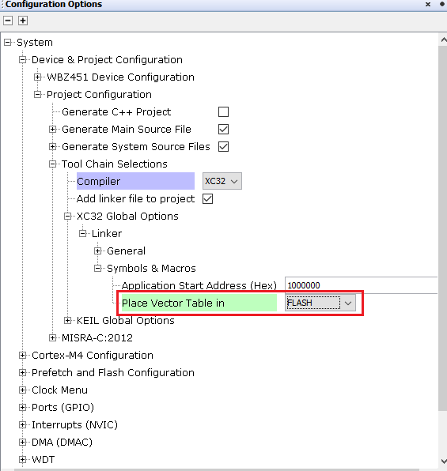
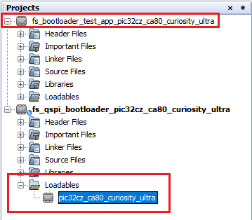
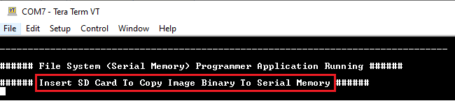
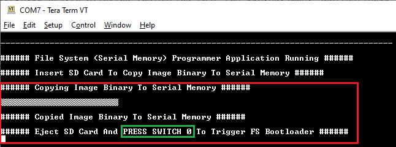
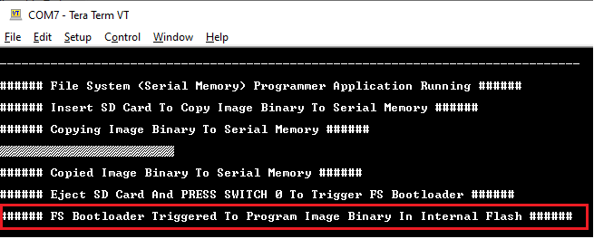
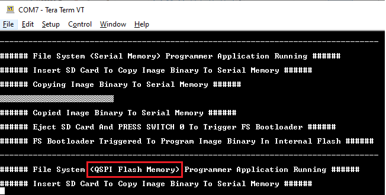

[](https://www.microchip.com)

# Building and Running the File System based QSPI Flash Bootloader applications

## Downloading and building the application

To clone or download this application from Github,go to the [main page of this repository](https://github.com/Microchip-MPLAB-Harmony/bootloader_apps_serial_memory) and then click Clone button to clone this repo or download as zip file. This content can also be download using content manager by following [these instructions](https://github.com/Microchip-MPLAB-Harmony/contentmanager/wiki)

Path of the application within the repository is **apps/fs/qspi/**

To build the application, refer to the following table and open the project using its IDE.

### Bootloader Application

| Project Name      | Description                                    |
| ----------------- | ---------------------------------------------- |
| bootloader/pic32cxbz_wbz451.X   | MPLABX Project for [PIC32CX-BZ2 and WBZ451 Curiosity Development Board](https://www.microchip.com/en-us/development-tool/ev96b94a)|


### Programmer application

| Project Name      | Description                                    |
| ----------------- | ---------------------------------------------- |
| app_programmer/pic32cxbz_wbz451.X   | MPLABX Project for [PIC32CX-BZ2 and WBZ451 Curiosity Development Board](https://www.microchip.com/en-us/development-tool/ev96b94a)|

## Setting up [PIC32CX-BZ2 and WBZ451 Curiosity Development Board](https://www.microchip.com/en-us/development-tool/ev96b94a)

- To run the demo, the following additional hardware are required:
    - One micro SD Card

- Connect the Debug USB port on the board to the computer using a micro USB cable

## Running the Application

1. Open the bootloader project *bootloader/pic32cz_ca80_curiosity_ultra.X* in the IDE

2.Change the place vector table from BOOT_FLASH to FLASH memory
	
	
3. Make sure that the *app_programmer/pic32cz_ca80_curiosity_ultra.X* is added as a loadable project to bootloader application
    - As the QSPI Flash memory may not have any valid binary **required by bootloader** for the first time, Adding the **app_programmer as loadable** allows MPLAB X to create a **unified hex file** and program both these applications in their respective memory locations based on their linker script configurations

    

4. Open the Terminal application (Ex.:Tera Term) on the computer to get programmer application messages through UART once loaded
5. Configure the serial port settings as follows:
    - Baud : 115200
    - Data : 8 Bits
    - Parity : None
    - Stop : 1 Bit
    - Flow Control : None

6. Build and program the **bootloader application** using the IDE

7. Once programming is done bootloader starts execution and directly jumps to application space to **run the programmer application**
    - **LED0** starts blinking indicating that the **programmer application** is running and you should see below output on the console

        

8. Open the programmer application project *app_programmer/pic32cz_ca80_curiosity_ultra.X* in the IDE

9. Update **app_programmer/firmware/src/app_monitor.c** to update printf message from **Serial Memory** to **QSPI Flash Memory** as below

    ```c
printf("\r\n###### File System (QSPI Flash Memory) Programmer Application Running ######\r\n");
    ```

10. Clean and Build the project to generate the binary **(Do not program the binary)**

11. Copy the generated application binary file to a sdcard from the Host PC
    - *\<harmony3_path\>/bootloader_apps_serial_memory/apps/fs/qspi/app_programmer/pic32cz_ca80_curiosity_ultra.X/dist/pic32cz_ca80_curiosity_ultra/production/pic32cz_ca80_curiosity_ultra.X.production.bin*

12. Rename the copied application binary file to **image.bin**

13. Insert the sdcard with the application binary **image.bin** in the sdcard slot of the device
14. Following snapshot shows output of successfully copying the **programmer application** binary to QSPI Flash Memory
    - **LED0** should still be blinking

        

15. Remove the sdcard from the sdcard slot

16. Press and hold the Switch **SW0** to trigger Bootloader from programmer application and you should see below output

    

17. Once Firmware Update is successful **LED0** should start blinking indicating updated programmer application running and you should see below output on the console

    

## Additional Steps (Optional)
- To bootload any other application refer to [Application Configurations](../../../docs/readme_configure_application_sam.md)
    - **Note that this application should have programming capabilities to QSPI Flash Memory**

- Once done repeat the applicable steps mentioned in [Running The Application](#running-the-application)
