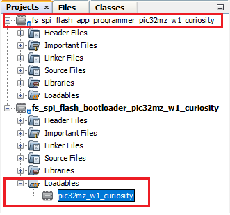
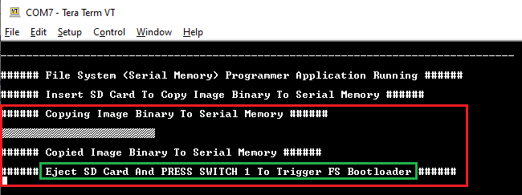
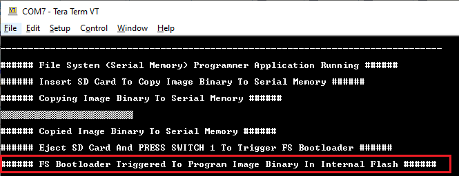
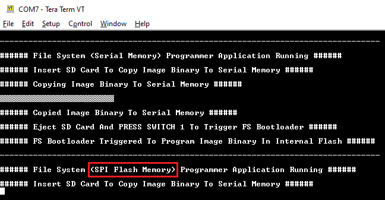

[](https://www.microchip.com)

# Building and Running the File System based SPI Flash Bootloader applications

## Downloading and building the application

To clone or download this application from Github,go to the [main page of this repository](https://github.com/Microchip-MPLAB-Harmony/bootloader_apps_serial_memory) and then click Clone button to clone this repo or download as zip file. This content can also be download using content manager by following [these instructions](https://github.com/Microchip-MPLAB-Harmony/contentmanager/wiki)

Path of the application within the repository is **apps/fs/spi/**

To build the application, refer to the following table and open the project using its IDE.

### Bootloader Application

| Project Name      | Description                                    |
| ----------------- | ---------------------------------------------- |
| bootloader/firmware/pic32mz_w1_curiosity.X    | MPLABX Project for [PIC32 WFI32E Curiosity Board](https://www.microchip.com/Developmenttools/ProductDetails/EV12F11A)|


### Programmer application

| Project Name      | Description                                    |
| ----------------- | ---------------------------------------------- |
| app_programmer/firmware/pic32mz_w1_curiosity.X    | MPLABX Project for [PIC32 WFI32E Curiosity Board](https://www.microchip.com/Developmenttools/ProductDetails/EV12F11A)|


## Setting up [PIC32 WFI32E Curiosity Board](https://www.microchip.com/Developmenttools/ProductDetails/EV12F11A)

- To run the demo, the following additional hardware are required:
    - One [IO1 Xplained Pro Extension Kit](https://www.microchip.com/developmenttools/ProductDetails/ATIO1-XPRO)

    - One micro SD Card

- Connect [IO1 Xplained Pro Extension Kit](https://www.microchip.com/developmenttools/ProductDetails/ATIO1-XPRO) to the J203 XPRO header of PIC32 WFI32E Curiosity Board

- On the GPIO Header (J207), connect U1RX (PIN 13) and U1TX (PIN 23) to TX and RX pin of any USB to UART converter (for eg: [USB UART click board](https://www.mikroe.com/usb-uart-click))

- Connect the Debug USB port on the board to the computer using a micro USB cable

## Running the Application

1. Open the bootloader project *bootloader/firmware/pic32mz_w1_curiosity.X* in the IDE

2. Make sure that the *app_programmer/firmware/pic32mz_w1_curiosity.X* is added as a loadable project to bootloader application
    - As the SPI Flash memory may not have any valid binary **required by bootloader** for the first time, Adding the **app_programmer as loadable** allows MPLAB X to create a **unified hex file** and program both these applications in their respective memory locations based on their linker script configurations

    

3. Open the Terminal application (Ex.:Tera Term) on the computer to get programmer application messages through UART once loaded
4. Configure the serial port settings as follows:
    - Baud : 115200
    - Data : 8 Bits
    - Parity : None
    - Stop : 1 Bit
    - Flow Control : None

5. Build and program the **bootloader application** using the IDE

6. Once programming is done bootloader starts execution and directly jumps to application space to **run the programmer application**
    - **RED LED (D202)** starts blinking indicating that the **programmer application** is running and you should see below output on the console

        

7. Open the programmer application project *app_programmer/firmware/pic32mz_w1_curiosity.X* in the IDE

8. Update **app_programmer/firmware/src/app_monitor.c** to update printf message from **Serial Memory** to **SPI Flash Memory** as below

    ```c
    printf("\r\n###### File System (SPI Flash Memory) Programmer Application Running ######\r\n");
    ```

9. Clean and Build the project to generate the binary **(Do not program the binary)**

10. Copy the generated application binary file to a sdcard from the Host PC
    - *\<harmony3_path\>/bootloader_apps_serial_memory/apps/fs/spi/app_programmer/firmware/pic32mz_w1_curiosity.X/dist/pic32mz_w1_curiosity/production/pic32mz_w1_curiosity.X.production.bin*

11. Rename the copied application binary file to **image.bin**

12. Insert the sdcard with the application binary **image.bin** in the micro-SD Card slot of the [IO1 Xplained Pro Extension Kit](https://www.microchip.com/developmenttools/ProductDetails/ATIO1-XPRO)

13. Following snapshot shows output of successfully copying the **programmer application** binary to SPI Flash Memory
    - **RED LED (D202)** should still be blinking

        

14. Remove the sdcard from the sdcard slot

15. Press and hold the Switch **SW1/SW200** to trigger Bootloader from programmer application and you should see below output

    

11. Once Firmware Update is successful **RED LED (D202)** should start blinking indicating updated programmer application running and you should see below output on the console

    

## Additional Steps (Optional)
- To bootload any other application refer to [Application Configurations](../../../docs/readme_configure_application_pic32m.md)
    - **Note that this application should have programming capabilities to SPI Flash Memory**

- Once done repeat the applicable steps mentioned in [Running The Application](#running-the-application)
