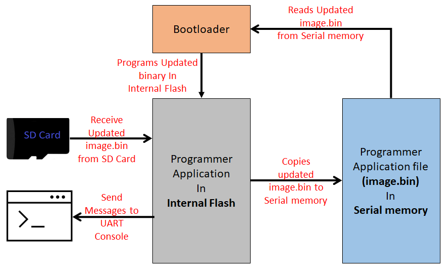

To clone or download these application from Github,go to the [main page of this repository](https://github.com/Microchip-MPLAB-Harmony/bootloader_apps_serial_memory) and then click Clone button to clone this repo or download as zip file. This content can also be download using content manager by following [these instructions](https://github.com/Microchip-MPLAB-Harmony/contentmanager/wiki)

# FS SPI Flash Bootloader

This example application shows how to use the File System Bootloader Library to bootload an application from SPI Flash memory (SST26) to Internal Flash.

### FS Serial Memory Bootloader Applications Block Diagram

### Bootloader Application

- This is a File System based bootloader application which resides from
    - The starting location of the Boot flash memory region for PIC32MZ devices
        - Uses a Custom linker script **btl.ld** to place it in Boot flash memory

- It uses the Harmony 3 File System Framework to read the application binary **(image.bin)** stored in **SPI Flash Memory** and program it into **Internal flash memory**

- It glows an LED once bootloader firmware is running

- Trigger Methods
    - It uses the On board Switch OR a GPIO pin as bootloader trigger pin to force enter the bootloader at reset of device
    - It checks for bootloader request pattern **(0x5048434D)** from the starting 16 Bytes of RAM to force enter bootloader at reset of device

### Programmer Application

- This is a File system based SPI Flash programmer application which resides from
    - The start of Program Flash memory for PIC32MZ devices

- It will be loaded into **internal flash memory** from **SPI Flash Memory** by bootloader application

- Uses the Virtual Com port of the device (EDBG port or External USB to UART converters) to send console messages

**It Consist of three tasks**

1. **SDCARD_Tasks():**
    - Receives the binary file **image.bin** to be copied into SPI Flash from SD Card
        - As the application running in internal flash should have capability to copy new binary file to SPI Flash memory, we copy the **programmer application binary itself** in SPI Flash Memory

    - Prints copying status on UART console

2. **SERIAL_MEM_Tasks():**
    - Formats the SPI Flash memory to **FAT File System if not formatted**

    - Copies the binary file received by **SDCARD_Tasks()** to **image.bin** file in SPI Flash Memory. The copied **image.bin** from SPI Flash memory will be read by bootloader and programmed into internal flash

    - Prints messages on UART console

3. **APP_MONITOR_Tasks():**
    - Blinks an LED every 1 second

    - Prints messages on UART console

    - Uses On board Switch OR a GPIO pin to trigger bootloader once copying of image binary to SPI Flash memory is commplete

## Development Kits
The following table provides links to documentation on how to build and run File System based SPI Flash bootloader on different development kits

| Development Kit |
|:---------|
|[PIC32 WFI32E Curiosity Board](docs/readme_pic32mz_w1_curiosity.md) |

