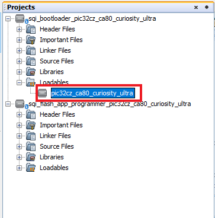
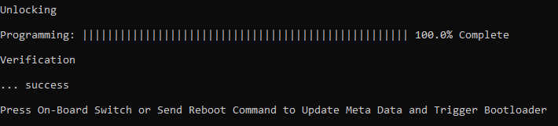
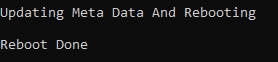

[](https://www.microchip.com)

# Building and Running the QSPI Flash Bootloader applications

## Downloading and building the application

To clone or download this application from Github,go to the [main page of this repository](https://github.com/Microchip-MPLAB-Harmony/bootloader_apps_serial_memory) and then click Clone button to clone this repo or download as zip file. This content can also be download using content manager by following [these instructions](https://github.com/Microchip-MPLAB-Harmony/contentmanager/wiki)

Path of the application within the repository is **apps/qspi_flash_bootloader/**

To build the application, refer to the following table and open the project using its IDE.

### Bootloader Application

| Project Name      | Description                                    |
| ----------------- | ---------------------------------------------- |
| bootloader/firmware/pic32cz_ca80_cult.X    | MPLABX Project for [PIC32CZ CA80 Curiosity Ultra](https://www.microchip.com/en-us/development-tool/ea61x20a)|


### Programmer application

| Project Name      | Description                                    |
| ----------------- | ---------------------------------------------- |
| app_programmer/firmware/pic32cz_ca80_cult.X    | MPLABX Project for [PIC32CZ CA80 Curiosity Ultra](https://www.microchip.com/en-us/development-tool/ea61x20a)|

## Setting up [PIC32CZ CA80 Curiosity Ultra](https://www.microchip.com/en-us/development-tool/ea61x20a)

- Connect the Debug USB port on the board to the computer using a micro USB cable

## Setting up the host script

- Refer to [UART Host Script Help](../../../tools/docs/readme_uart_host.md) for setting up the **uart_host.py** utility used to send the application binary from host PC
    - There will be no reset command sent from host after programming by default.
    
    - Reboot command has to be sent separately only after successful programming to trigger bootloader from **programmer application**

## Running the Application

1. Open the bootloader project *bootloader/firmware/pic32cz_ca80_cult.X* in the IDE

2. Make sure that the *app_programmer/firmware/pic32cz_ca80_cult.X* is added as a loadable project to bootloader application
    - As the QSPI Flash memory may not have any valid binary **required by bootloader** for the first time, Adding the **app_programmer as loadable** allows MPLAB X to create a **unified hex file** and program both these applications in their respective memory locations based on their linker script configurations

    

3. Build and program the **bootloader application** using the IDE

4. Once programming is done bootloader starts execution and directly jumps to application space to **run the programmer application**
    - **LED1** starts blinking every **500ms** indicating that the **programmer application** is running

5. Open the programmer application project *app_programmer/firmware/pic32cz_ca80_cult.X* in the IDE

6. Update **app_programmer/firmware/src/app.c** to reduce the LED blink duration from **500ms** to **100ms** as below

    ```c
    APP_TIMER_DelayMs(100);
    ```

7. Clean and Build the project to generate the binary **(Do not program the binary)**

8. Run the **uart_host.py** from command prompt to program the **updated programmer application binary** in QSPI Flash memory

        python <harmony3_path>/bootloader_apps_serial_memory/tools/uart_host.py -v -i <COM PORT> -d pic32cz -a 0xc000000 -f <harmony3_path>/bootloader_apps_serial_memory/apps/qspi_flash_bootloader/app_programmer/firmware/pic32cz_ca80_cult.X/dist/pic32cz_ca80_cult/production/pic32cz_ca80_cult.X.production.bin

9. Following snapshot shows output of successfully programming the **programmer application**
    - **LED1** should still be blinking every **500ms**

    

10. Run the **uart_host.py** from command prompt to send a **Reboot** command. This command Updates **MetaData** and **triggers Bootloader** to program the **updated binary from QSPI Flash to Internal Flash**

        python <harmony3_path>/bootloader_apps_serial_memory/tools/uart_host.py -v -i <COM PORT> -r

    

11. Once Firmware Update is successful **LED1** should start blinking every **100ms** indicating updated programmer application running
    - If there was any error you may need to power cycle the device to retry firmware upgrade

12. Update **app_programmer/firmware/src/app.c** to revert LED blink duration to **500ms** from **100ms** as below

    ```c
    APP_TIMER_DelayMs(500);
    ```

13. Clean and Build the project to generate the binary **(Do not program the binary)**

14. Repeat Step 8-9.
    - You should see **LED1** still blinking every **100ms**

15. Press the Switch **SW0** to Update **MetaData** and **trigger Bootloader** to program the **updated binary from QSPI Flash to Internal Flash**

16. Once Firmware Update is successful **LED1** should start blinking every **500ms** indicating updated programmer application running
    - If there was any error you may need to power cycle the device to retry firmware upgrade

## Additional Steps (Optional)
- To bootload any other application refer to [Application Configurations](../../docs/readme_configure_application_sam.md)
    - **Note that this application should have programming capabilities to QSPI Flash Memory**

- Once done repeat the applicable steps mentioned in [Running The Application](#running-the-application)
