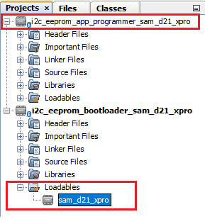

# SAM D21 Xplained Pro Evaluation Kit: Building and Running the I2C EEPROM Bootloader applications

**Parent topic:**[I2C EEPROM Bootloader](GUID-2216EC1D-BD5B-4507-B798-FBDE45E7C643.md)

## Downloading and building the application

To clone or download this application from Github,go to the [main page of this repository](https://github.com/Microchip-MPLAB-Harmony/bootloader_apps_serial_memory) and then click Clone button to clone this repo or download as zip file. This content can also be download using content manager by following [these instructions](https://github.com/Microchip-MPLAB-Harmony/contentmanager/wiki)

Path of the application within the repository is **apps/i2c\_eeprom\_bootloader/**

To build the application, refer to the following table and open the project using its IDE.

## Bootloader Application

|Project Name|Description|
|------------|-----------|
|bootloader/firmware/sam\_d21\_xpro.X|MPLABX Project for [SAM D21 Xplained Pro Evaluation Kit](https://www.microchip.com/developmenttools/ProductDetails/atsamd21-xpro)|

## Programmer application

|Project Name|Description|
|------------|-----------|
|app\_programmer/firmware/sam\_d21\_xpro.X|MPLABX Project for [SAM D21 Xplained Pro Evaluation Kit](https://www.microchip.com/developmenttools/ProductDetails/atsamd21-xpro)|

## Setting up [SAM D21 Xplained Pro Evaluation Kit](https://www.microchip.com/developmenttools/ProductDetails/atsamd21-xpro)

-   To run the demo, the following additional hardware are required:

    -   One [EEPROM 3 Click](https://www.mikroe.com/eeprom-3-click) board

    -   One [mikroBUS Xplained Pro](https://www.microchip.com/developmenttools/ProductDetails/ATMBUSADAPTER-XPRO) board

-   Install the [EEPROM 3 Click](https://www.mikroe.com/eeprom-3-click) on to the [mikroBUS Xplained Pro board](https://www.microchip.com/developmenttools/ProductDetails/ATMBUSADAPTER-XPRO)

-   Connect [mikroBUS Xplained Pro board](https://www.microchip.com/developmenttools/ProductDetails/ATMBUSADAPTER-XPRO) to the **EXT2** header

-   Connect the Debug USB port on the board to the computer using a micro USB cable


## Setting up the host script

-   Refer to [UART Host Script Help](GUID-68689A7C-FEE2-4993-A6B4-0F4C71163040.md) for setting up the **uart\_host.py** utility used to send the application binary from host PC

    -   There will be no reset command sent from host after programming by default.

    -   Reboot command has to be sent separately only after successful programming to trigger bootloader from **programmer application**


## Running the Application

1.  Open the bootloader project *bootloader/firmware/sam\_d21\_xpro.X* in the IDE

2.  Make sure that the *app\_programmer/firmware/sam\_d21\_xpro.X* is added as a loadable project to bootloader application

    -   As the I2C EEPROM may not have any valid binary **required by bootloader** for the first time, Adding the **app\_programmer as loadable** allows MPLAB X to create a **unified hex file** and program both these applications in their respective memory locations based on their linker script configurations

    

3.  Build and program the **bootloader application** using the IDE

4.  Once programming is done bootloader starts execution and directly jumps to application space to **run the programmer application**

    -   **LED0** starts blinking every **500ms** indicating that the **programmer application** is running

5.  Open the programmer application project *app\_programmer/firmware/sam\_d21\_xpro.X* in the IDE

6.  Update **app\_programmer/firmware/src/app.c** to reduce the LED blink duration from **500ms** to **100ms** as below

    ```c
    	APP_TIMER_DelayMs(100);
    ```

7.  Clean and Build the project to generate the binary **\(Do not program the binary\)**

8.  Run the **uart\_host.py** from command prompt to program the **updated programmer application binary** in I2C EEPROM

    ```
     python <harmony3_path>/bootloader_apps_serial_memory/tools/uart_host.py -v -i <COM PORT> -d samd2x -a 0x2000 -f <harmony3_path>/bootloader_apps_serial_memory/apps/i2c_eeprom_bootloader/app_programmer/firmware/sam_d21_xpro.X/dist/sam_d21_xpro/production/sam_d21_xpro.X.production.bin
    ```

9.  Following snapshot shows output of successfully programming the **programmer application**

    -   **LED0** should still be blinking every **500ms**

    

10. Run the **uart\_host.py** from command prompt to send a **Reboot** command. This command Updates **MetaData** and **triggers Bootloader** to program the **updated binary from I2C EEPROM to Internal Flash**

    ```
    python <harmony3_path>/bootloader_apps_serial_memory/tools/uart_host.py -v -i <COM PORT> -r
    ```

    

11. Once Firmware Update is successful **LED0** should start blinking every **100ms** indicating updated programmer application running

    -   If there was any error you may need to power cycle the device to retry firmware upgrade

12. Update **app\_programmer/firmware/src/app.c** to revert LED blink duration to **500ms** from **100ms** as below

    ```c
    APP_TIMER_DelayMs(500);
    ```

13. Clean and Build the project to generate the binary **\(Do not program the binary\)**

14. Repeat Step 8-9.

    -   You should see **LED0** still blinking every **100ms**

15. Press the Switch **SW0** to Update **MetaData** and **trigger Bootloader** to program the **updated binary from I2C EEPROM to Internal Flash**

16. Once Firmware Update is successful **LED0** should start blinking every **500ms** indicating updated programmer application running

    -   If there was any error you may need to power cycle the device to retry firmware upgrade


## Additional Steps \(Optional\)

-   To bootload any other application refer to [Application Configurations](GUID-ACA78B67-6A7C-4862-9C34-7A1270D69837.md)

    -   **Note that this application should have programming capabilities to I2C EEPROM**

-   Once done repeat the applicable steps mentioned in [Running The Application](#running-the-application)


