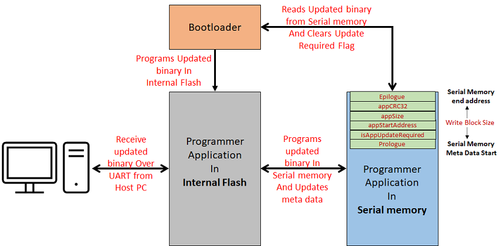

# SPI Flash Bootloader

This example application shows how to use the Serial Memory Bootloader Library to bootload an application from SPI Flash memory \(SST26\) to Internal Flash.

**Serial Memory Bootloader Applications Block Diagram**

**Bootloader Application**

-   This is a bootloader application which resides from

    -   The starting location of the Boot flash memory region for PIC32MZ devices

        -   Uses a Custom linker script **btl.ld** to place it in Boot flash memory

**Performs Below Operation:**

1.  Sets up the SPI Flash \(SST26\) using the SST26 driver and SPI Peripheral Library

2.  Checks if a firmware update is required by reading the **MetaData** stored in the last sector of SPI Flash

    -   If Firmware update is required then it jumps to **Step 4**

3.  If there was no firmware update request through **MetaData**, then it checks for any trigger implemented in application main\(\)

    -   Here we use the On-board Switch to force trigger firmware update.

    -   If no trigger is found then it jumps to **Step 7**

4.  If firmware update is required then it

    -   Reads the **programmer application** binary stored from start of SPI flash memory **\(0x0\)**

    -   Programs the read binary to application space in Internal Flash

5.  Once programming is done it generates a CRC32 value over programmed space and verifies it against the CRC32 stored in SPI Flash MetaData

    -   If CRC32 verification fails it goes into Error State

6.  If CRC32 verification is successful, It clears the **firmware update required flag** in the SPI Flash MetaData and **triggers a Soft Reset**

    -   After reset, bootloader starts from **Step 1** through **Step 3** to do firmware update check and then jump to **Step 7**

7.  If there was no firmware update required then it

    -   Calls the SYS\_Deinitialize\(\) function which releases the resources used. **This Function is device specific and has to be implemented based on application requirement**

    -   **Jumps to application space to run the programmer application**

**Programmer Application**

-   This is a SPI Flash programmer application which resides from

    -   The end of bootloader size in device flash memory for SAM devices

    -   The start of Program Flash memory for PIC32MZ devices

        -   Uses a Custom linker script **app\_mz.ld** to place it in Program flash memory

-   It will be loaded into **internal flash memory** from **SPI Flash Memory** by bootloader application

-   It blinks an LED every 500Ms and has capabilty to program SPI Flash memory \(SST26\) using SST26 Driver and SPI peripheral Library

-   It uses the Virtual Com port of the device \(EDBG port or External USB to UART converters\) to receive the binary to be programmed in SPI Flash from host PC

    -   As the application running in internal flash should have capability to program SPI Flash memory, we send the **programmer application binary itself** via UART to be programmed in SPI Flash Memory

-   It calls the APP\_INPUT\_Tasks\(\) function which receives the binary to be programmed into SPI flash memory over UART channel

    -   It uses the UART bootloader protocol but is updated to run along with other tasks

-   Once the binary is received and programmed from start location of SPI Flash memory it generates a CRC32 value over programmed SPI Flash space and verifies it against the CRC32 sent from host PC

    -   It Also Updates the CRC32 value received in the SPI Flash MetaData used by bootloader

    -   If CRC32 verification fails it goes into Error State then resets the APP\_INPUT\_Tasks\(\) state to receive new binary

-   If verification is successful then it

    -   Waits for one of below user event to update the **MetaData** and **trigger bootloader** via soft reset to program new binary in Internal Flash **OR**

        -   A Switch press **OR**

        -   A Reboot command from Host PC

    -   Waits for a new binary to be programmed in SPI Flash memory.

**Development Kits** The following table provides links to documentation on how to build and run SPI Flash bootloader on different development kits

-   **[PIC32 WFI32E Curiosity Board: Building and Running the SPI Flash Bootloader applications](GUID-C0562670-0CEA-4FDA-B7CE-BF104FC674BA.md)**  

**Parent topic:**[MPLAB® Harmony 3 Serial Memory Bootloader Application Examples](GUID-47AB0512-9DCE-469D-91C9-7448A07AAAA7.md)

