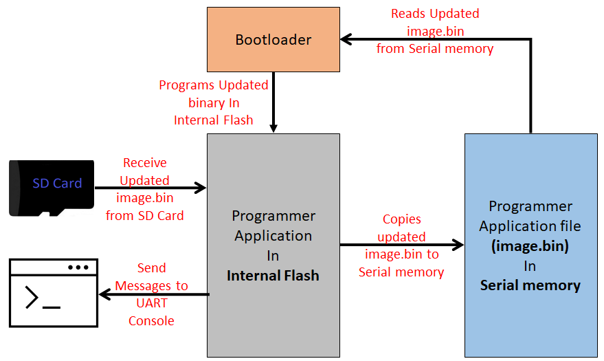

# FS QSPI Flash Bootloader

This example application shows how to use the File System Bootloader Library to bootload an application from QSPI Flash memory \(SST26\) to Internal Flash.

**FS Serial Memory Bootloader Applications Block Diagram**

**Bootloader Application**

-   This is a File System based bootloader application which resides from

    -   The starting location of the flash memory region for SAM devices

    -   The starting location of the Boot flash memory region for PIC32MZ devices

        -   Uses a Custom linker script **btl.ld** to place it in Boot flash memory

-   It uses the Harmony 3 File System Framework to read the application binary **\(image.bin\)** stored in **QSPI Flash Memory** and program it into **Internal flash memory**

-   It glows an LED once bootloader firmware is running

-   Trigger Methods

    -   It uses the On board Switch OR a GPIO pin as bootloader trigger pin to force enter the bootloader at reset of device

    -   It checks for bootloader request pattern **\(0x5048434D\)** from the starting 16 Bytes of RAM to force enter bootloader at reset of device

**Programmer Application**

-   This is a File system based QSPI Flash programmer application which resides from

    -   The end of bootloader size in device flash memory for SAM devices

    -   The start of Program Flash memory for PIC32MZ devices

-   It will be loaded into **internal flash memory** from **QSPI Flash Memory** by bootloader application

-   Uses the Virtual Com port of the device \(EDBG port or External USB to UART converters\) to send console messages

**It Consist of three tasks**

1.  **SDCARD\_Tasks\(\):**

    -   Receives the binary file **image.bin** to be copied into QSPI Flash from SD Card

        -   As the application running in internal flash should have capability to copy new binary file to QSPI Flash memory, we copy the **programmer application binary itself** in QSPI Flash Memory

    -   Prints copying status on UART console

2.  **SERIAL\_MEM\_Tasks\(\):**

    -   Formats the QSPI Flash memory to **FAT File System if not formatted**

    -   Copies the binary file received by **SDCARD\_Tasks\(\)** to **image.bin** file in QSPI Flash Memory. The copied **image.bin** from QSPI Flash memory will be read by bootloader and programmed into internal flash

    -   Prints messages on UART console

3.  **APP\_MONITOR\_Tasks\(\):**

    -   Blinks an LED every 1 second

    -   Prints messages on UART console

    -   Uses On board Switch OR a GPIO pin to trigger bootloader once copying of image binary to QSPI Flash memory is complete

**Development Kits** The following table provides links to documentation on how to build and run File System based QSPI Flash bootloader on different development kits

-   **[Curiosity PIC32MZ EF 2.0 Development Board: Building and Running the File System based QSPI Flash Bootloader applications](GUID-91FF64BD-84D4-43A7-BD5B-9554B5C144C7.md)**  

-   **[PIC32CZ CA80 Evaluation Board: Building and Running the File System based QSPI Flash Bootloader applications](GUID-57D92BCC-F8D0-4A58-86ED-43D6409EF49C.md)**  

-   **[SAM E54 Xplained Pro Evaluation Kit: Building and Running the File System based QSPI Flash Bootloader applications](GUID-DD735FDA-DB2B-4AA2-A212-0699B7339BA5.md)**  

-   **[SAM E70 Xplained Ultra Evaluation Kit: Building and Running the File System based QSPI Flash Bootloader applications](GUID-382EB464-0B96-4889-A7F7-77EDD2060DDB.md)**  

-   **[WBZ451 Curiosity Development Board: Building and Running the File System based QSPI Flash Bootloader applications](GUID-9555C050-5DAC-41C6-894C-8266DE47FB67.md)**  

**Parent topic:**[MPLAB® Harmony 3 Serial Memory Bootloader Application Examples](GUID-47AB0512-9DCE-469D-91C9-7448A07AAAA7.md)

