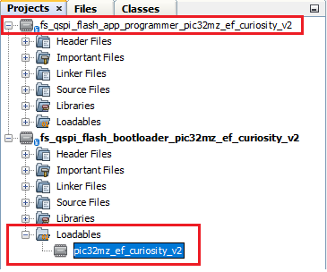
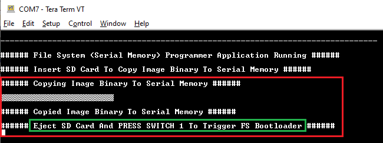
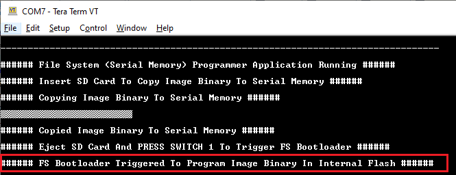
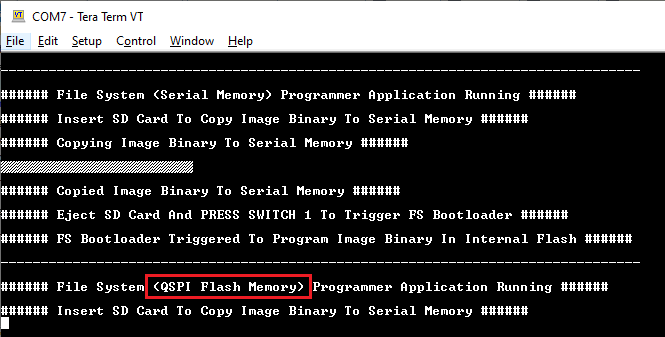

# Curiosity PIC32MZ EF 2.0 Development Board: Building and Running the File System based QSPI Flash Bootloader applications

**Parent topic:**[FS QSPI Flash Bootloader](GUID-869C6F23-D894-4AFC-8486-1605C07220A7.md)

## Downloading and building the application

To clone or download this application from Github,go to the [main page of this repository](https://github.com/Microchip-MPLAB-Harmony/bootloader_apps_serial_memory) and then click Clone button to clone this repo or download as zip file. This content can also be download using content manager by following [these instructions](https://github.com/Microchip-MPLAB-Harmony/contentmanager/wiki)

Path of the application within the repository is **apps/fs/qspi/**

To build the application, refer to the following table and open the project using its IDE.

## Bootloader Application

|Project Name|Description|
|------------|-----------|
|bootloader/firmware/pic32mz\_ef\_curiosity\_v2.X|MPLABX Project for [Curiosity PIC32MZ EF 2.0 Development Board](https://www.microchip.com/developmenttools/ProductDetails/DM320209)|

## Programmer application

|Project Name|Description|
|------------|-----------|
|app\_programmer/firmware/pic32mz\_ef\_curiosity\_v2.X|MPLABX Project for [Curiosity PIC32MZ EF 2.0 Development Board](https://www.microchip.com/developmenttools/ProductDetails/DM320209)|

## Setting up [Curiosity PIC32MZ EF 2.0 Development Board](https://www.microchip.com/developmenttools/ProductDetails/DM320209)

-   To run the demo, the following additional hardware are required:

    -   One [microSD click](https://www.mikroe.com/microsd-click)

    -   One micro SD Card

-   Install the [microSD click](https://www.mikroe.com/microsd-click) on to the **mikroBUS 1 Header** of the device

-   For programming and UART Console, connect a micro USB cable to the USB Debug port J700


## Running the Application

1.  Open the bootloader project *bootloader/firmware/pic32mz\_ef\_curiosity\_v2.X* in the IDE

2.  Make sure that the *app\_programmer/firmware/pic32mz\_ef\_curiosity\_v2.X* is added as a loadable project to bootloader application

    -   As the QSPI Flash memory may not have any valid binary **required by bootloader** for the first time, Adding the **app\_programmer as loadable** allows MPLAB X to create a **unified hex file** and program both these applications in their respective memory locations based on their linker script configurations

    

3.  Open the Terminal application \(Ex.:Tera Term\) on the computer to get programmer application messages through UART once loaded

4.  Configure the serial port settings as follows:

    -   Baud : 115200

    -   Data : 8 Bits

    -   Parity : None

    -   Stop : 1 Bit

    -   Flow Control : None

5.  Build and program the **bootloader application** using the IDE

6.  Once programming is done bootloader starts execution and directly jumps to application space to **run the programmer application**

    -   **LED3** starts blinking indicating that the **programmer application** is running and you should see below output on the console

        

7.  Open the programmer application project *app\_programmer/firmware/pic32mz\_ef\_curiosity\_v2.X* in the IDE

8.  Update **app\_programmer/firmware/src/app\_monitor.c** to update printf message from **Serial Memory** to **QSPI Flash Memory** as below

    ```c
    	printf("\r\n###### File System (QSPI Flash Memory) Programmer Application Running ######\r\n");
    ```

9.  Clean and Build the project to generate the binary **\(Do not program the binary\)**

10. Copy the generated application binary file to a sdcard from the Host PC

    -   *<harmony3\_path\>/bootloader\_apps\_serial\_memory/apps/fs/qspi/app\_programmer/firmware/pic32mz\_ef\_curiosity\_v2.X/dist/pic32mz\_ef\_curiosity\_v2/production/pic32mz\_ef\_curiosity\_v2.X.production.bin*

11. Rename the copied application binary file to **image.bin**

12. Insert the sdcard with the application binary **image.bin** to the sdcard slot on the [microSD click](https://www.mikroe.com/microsd-click)

13. Following snapshot shows output of successfully copying the **programmer application** binary to QSPI Flash Memory

    -   **LED3** should still be blinking

        

14. Remove the sdcard from the sdcard slot

15. Press and hold the Switch **SW1** to trigger Bootloader from programmer application and you should see below output

    

16. Once Firmware Update is successful **LED3** should start blinking indicating updated programmer application running and you should see below output on the console

    


## Additional Steps \(Optional\)

-   To bootload any other application refer to [Application Configurations](GUID-A4C196CF-3963-4FBC-8519-B5F03A031812.md)

    -   **Note that this application should have programming capabilities to QSPI Flash Memory**

-   Once done repeat the applicable steps mentioned in [Running The Application](#running-the-application)


