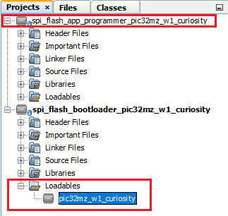

# PIC32 WFI32E Curiosity Board: Building and Running the SPI Flash Bootloader applications

**Parent topic:**[SPI Flash Bootloader](GUID-62C4D609-9D7F-4BEC-923E-5D077A2DECAB.md)

## Downloading and building the application

To clone or download this application from Github,go to the [main page of this repository](https://github.com/Microchip-MPLAB-Harmony/bootloader_apps_serial_memory) and then click Clone button to clone this repo or download as zip file. This content can also be download using content manager by following [these instructions](https://github.com/Microchip-MPLAB-Harmony/contentmanager/wiki)

Path of the application within the repository is **apps/spi\_flash\_bootloader/**

To build the application, refer to the following table and open the project using its IDE.

## Bootloader Application

|Project Name|Description|
|------------|-----------|
|bootloader/firmware/pic32mz\_w1\_curiosity.X|MPLABX Project for [PIC32 WFI32E Curiosity Board](https://www.microchip.com/Developmenttools/ProductDetails/EV12F11A)|

## Programmer application

|Project Name|Description|
|------------|-----------|
|app\_programmer/firmware/pic32mz\_w1\_curiosity.X|MPLABX Project for [PIC32 WFI32E Curiosity Board](https://www.microchip.com/Developmenttools/ProductDetails/EV12F11A)|

## Setting up [PIC32 WFI32E Curiosity Board](https://www.microchip.com/Developmenttools/ProductDetails/EV12F11A)

-   Connect the Debug USB port on the board to the computer using a micro USB cable

-   On the GPIO Header \(J207\), connect U1RX \(PIN 13\) and U1TX \(PIN 23\) to TX and RX pin of any USB to UART converter \(for eg: [USB UART click board](https://www.mikroe.com/usb-uart-click)\)


## Setting up the host script

-   Refer to [UART Host Script Help](GUID-66DF1214-3D81-4D16-9419-DB18057C31DD.md) for setting up the **uart\_host.py** utility used to send the application binary from host PC

    -   There will be no reset command sent from host after programming by default.

    -   Reboot command has to be sent separately only after successful programming to trigger bootloader from **programmer application**


## Running the Application

1.  Open the bootloader project *bootloader/firmware/pic32mz\_w1\_curiosity.X* in the IDE

2.  Make sure that the *app\_programmer/firmware/pic32mz\_w1\_curiosity.X* is added as a loadable project to bootloader application

    -   As the SPI Flash memory may not have any valid binary **required by bootloader** for the first time, Adding the **app\_programmer as loadable** allows MPLAB X to create a **unified hex file** and program both these applications in their respective memory locations based on their linker script configurations

    

3.  Build and program the **bootloader application** using the IDE

4.  Once programming is done bootloader starts execution and directly jumps to application space to **run the programmer application**

    -   **RED LED \(D202\)** starts blinking indicating that the **programmer application** is running

5.  Open the programmer application project *app\_programmer/firmware/pic32mz\_w1\_curiosity.X* in the IDE

6.  Update **app\_programmer/firmware/src/config/pic32mz\_w1\_curiosity/user.h** to use **GREEN LED \(D204\)** instead of **RED LED \(D202\)** as below

    ```c
    #define LED_TOGGLE()            LED_GREEN_Toggle()
    ```

7.  Clean and Build the project to generate the binary **\(Do not program the binary\)**

8.  Run the **uart\_host.py** from command prompt to program the **updated programmer application binary** in SPI Flash memory

    ```
     python <harmony3_path>/bootloader_apps_serial_memory/tools/uart_host.py -v -i <COM PORT> -d pic32mzw -a 0x90000000 -f <harmony3_path>/bootloader_apps_serial_memory/apps/spi_flash_bootloader/app_programmer/firmware/pic32mz_w1_curiosity.X/dist/pic32mz_w1_curiosity/production/pic32mz_w1_curiosity.X.production.bin
    ```

9.  Following snapshot shows output of successfully programming the **programmer application**

    -   **RED LED \(D202\)** should still be blinking

    

10. Run the **uart\_host.py** from command prompt to send a **Reboot** command. This command Updates **MetaData** and **triggers Bootloader** to program the **updated binary from SPI Flash to Internal Flash**

    ```
    python <harmony3_path>/bootloader_apps_serial_memory/tools/uart_host.py -v -i <COM PORT> -r
    ```

    

11. Once Firmware Update is successful **GREEN LED \(D204\)** should start blinking indicating updated programmer application running

    -   If there was any error you may need to power cycle the device to retry firmware upgrade

12. Update **app\_programmer/firmware/src/config/pic32mz\_w1\_curiosity/user.h** to revert to **RED LED \(D202\)** from **GREEN LED \(D204\)** as below

    ```c
    #define LED_TOGGLE()            LED_RED_Toggle()
    ```

13. Clean and Build the project to generate the binary **\(Do not program the binary\)**

14. Repeat Step 8-9.

    -   You should see **GREEN LED \(D204\)** still blinking

15. Press the Switch **SW1/SW200** to Update **MetaData** and **trigger Bootloader** to program the **updated binary from SPI Flash to Internal Flash**

16. Once Firmware Update is successful **RED LED \(D202\)** should start blinking indicating updated programmer application running

    -   If there was any error you may need to power cycle the device to retry firmware upgrade


## Additional Steps \(Optional\)

-   To bootload any other application refer to [Application Configurations](GUID-A4C196CF-3963-4FBC-8519-B5F03A031812.md)

    -   **Note that this application should have programming capabilities to SPI Flash Memory**

-   Once done repeat the applicable steps mentioned in [Running The Application](#running-the-application)


