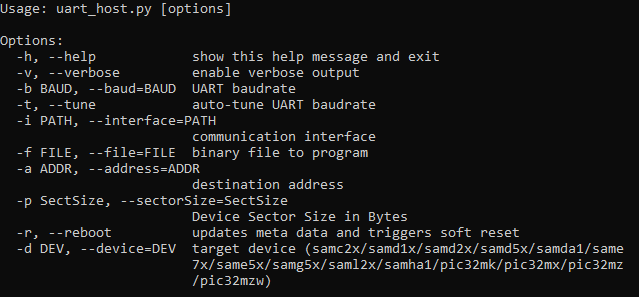

[](https://www.microchip.com)

# UART Host Script Help

This document describes the usage of **uart_host.py** host script

## Downloading the host script

To clone or download the host tools from Github,go to the [main page of this repository](https://github.com/Microchip-MPLAB-Harmony/bootloader_apps_serial_memory) and then click Clone button to clone this repo or download as zip file. This content can also be download using content manager by following [these instructions](https://github.com/Microchip-MPLAB-Harmony/contentmanager/wiki)

### Path of the tool in bootloader_apps_serial_memory repository is **tools/uart_host.py**

## Setting up the Host PC

- The Script is only compatible with **Python 3.x**

- It requires pyserial package to communicate with device over UART. Use below command to install the pyserial package

      pip3 install pyserial

## Description

- This host script should be used to communicate with the programmer application running on the device via **UART interface**

- It is a command line interface and implements the **uart bootloader protocol** required to communicate from host PC

- If size of the input binary file is not aligned to device erase boundary it appends 0xFF to the binary to make it aligned and then sends the binary to the device

- The input address for the host tool should be the **Internal Flash Address** from where the binary will run

- There will be no reset command sent from host after programming by default as done in uart bootloader case

- Reboot command has to be sent separately only after successful programming to trigger bootloader from **programmer application**

## Usage Examples

### Below is the syntax to show help menu for the script

```
python <harmony3_path>/bootloader_apps_serial_memory/tools/uart_host.py --help
```



### Below is the syntax and an example to program a binary in Serial Memory

```
python <harmony3_path>/bootloader_apps_serial_memory/tools/uart_host.py -v -i <COM PORT> -d <Device Name> -a <address> -f <Application_binary_path>
```

```c
python <harmony3_path>/bootloader/tools/btl_host.py -v -i COM7 -d same5x -a 0x2000 -f E:/projects/h3_bootloader/bootloader_apps_serial_memory/apps/qspi_flash_bootloader/app_programmer/firmware/sam_e54_xpro.X/dist/sam_e54_xpro/production/sam_e54_xpro.X.production.bin
```


### Below is the syntax and an example to send a Reboot command

```
python <harmony3_path>/bootloader_apps_serial_memory/tools/uart_host.py -v -i <COM PORT> -r
```

```c
python <harmony3_path>/bootloader/tools/btl_host.py -v -i COM7 -r
```


